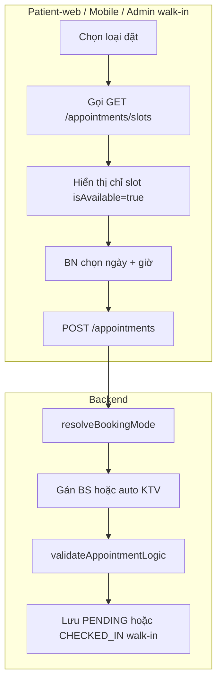
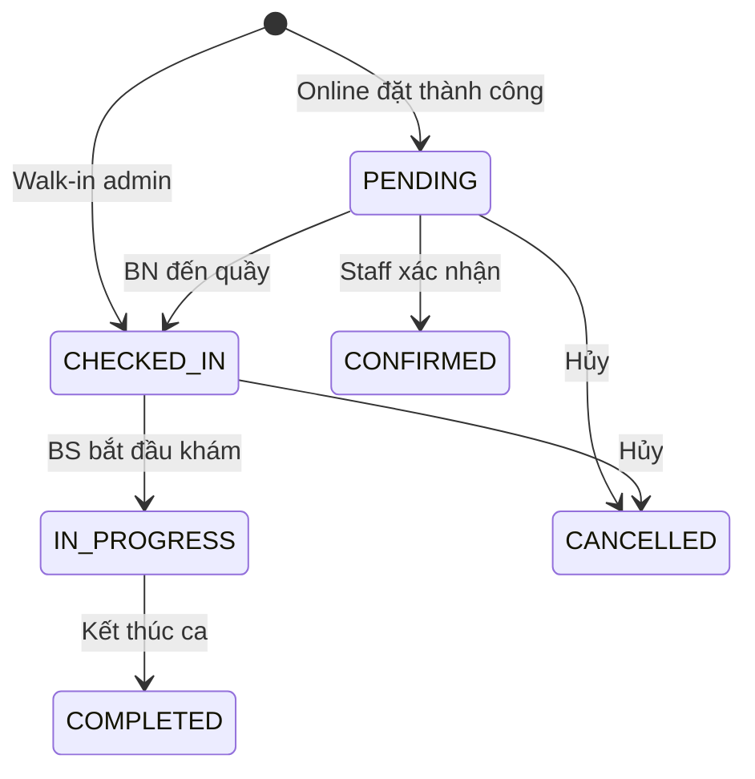

# Luồng đặt lịch — 2 chế độ (Bác sĩ / Xét nghiệm–X-Quang)

Tài liệu mô tả **2 luồng đặt lịch qua bảng `appointment`**, cơ chế **kiểm tra slot trống**, xử lý khi **hết lịch**, và triển khai trên **patient-web**, **mobile-app**, **admin-web**.

**Cập nhật:** 2026-06-24  
**Liên quan:** [`appointment_booking_flows.md`](appointment_booking_flows.md) (bản cũ 3–4 mode), [`appointment_flow_scenarios.md`](appointment_flow_scenarios.md) (edge case lễ tân/hàng đợi), [`../clinic_system.sql`](../clinic_system.sql)

---

## 1. Tổng quan

| # | Luồng | `booking_mode` | Ai đặt? | Bắt buộc chọn |
|---|--------|----------------|---------|----------------|
| **A** | Khám bác sĩ | `DOCTOR` | BN online / walk-in admin | **Chuyên khoa + Bác sĩ + Ngày + Giờ + Ghi chú** |
| **B** | Xét nghiệm / X-Quang | `SERVICE` | BN online / walk-in admin | **Dịch vụ (`LAB_TEST` hoặc `X_RAY`) + Ngày + Giờ + Ghi chú** — **không** chọn bác sĩ |
| **C** | Chỉ định khi đang khám | *(không qua `appointment`)* | Bác sĩ trong ca khám | `service_order` — FIFO phòng KTV, **không** xếp slot |

**Đã loại bỏ:** `EXPERTISE` (chỉ chọn khoa, hệ thống gán BS), `DIRECT`, đặt dịch vụ `EXAM`.

**Dịch vụ BN được đặt lịch trực tiếp:** chỉ `service_type` ∈ `{ LAB_TEST, X_RAY }`.  
Siêu âm, CT, MRI, Nội soi, OTHER — admin vẫn quản lý trong catalog nhưng **chỉ BS chỉ định** trong ca khám (luồng C).

---

## 2. Kiến trúc chung — Có check lịch trống không?

**Có.** Cả 2 luồng A và B đều qua API slot trước khi đặt, và backend **validate lại** lúc `POST /appointments`.



### 2.1. API slot

```
GET /api/v1/appointments/slots?date=YYYY-MM-DD&doctorId=   → Luồng A
GET /api/v1/appointments/slots?date=YYYY-MM-DD&serviceId=  → Luồng B
```

| Param | Luồng | Ý nghĩa |
|-------|--------|---------|
| `doctorId` | A | Slot theo lịch làm việc **một bác sĩ** |
| `serviceId` | B | Gộp slot **tất cả KTV** (`LAB_TECH`), bước nhảy = `estimated_duration` của dịch vụ |

**Nguồn slot:** bảng `staff_schedule` (ca làm việc theo ngày). Nếu nhân viên nghỉ phép → không sinh slot. Slot đã có appointment (trạng thái ≠ `CANCELLED` / `NO_SHOW`) → `isAvailable = false`.

### 2.2. API tạo lịch

```
POST /api/v1/appointments
```

Body chính: `bookingMode`, `appointmentDate`, `timeStart`, `timeEnd`, `note`, `appointmentType` (`ONLINE` | `WALK_IN`).

---

## 3. Luồng A — Đặt khám bác sĩ (`DOCTOR`)

### 3.1. Nghiệp vụ

1. BN chọn **chuyên khoa** (`expertiseId`).
2. BN chọn **bác sĩ** thuộc khoa đó (`mainDoctorId`).
3. Chọn **ngày** → gọi slot theo `doctorId`.
4. Chọn **giờ** trong danh sách slot còn trống.
5. Nhập triệu chứng / lý do (`note`).
6. Submit → `status = PENDING` (online) hoặc `CHECKED_IN` + số thứ tự (walk-in).

### 3.2. Backend validate (`AppointmentService`)

| Rule | Mô tả |
|------|--------|
| Bắt buộc | `expertiseId` + `mainDoctorId` |
| Khớp khoa | BS phải thuộc `expertiseId` đã chọn |
| Trùng giờ BN | Một BN không 2 lịch cùng `date + timeStart` |
| Online ≥ 24h | Đặt trước tối thiểu 24 giờ |
| Cuối tuần / lễ | Không đặt T7, CN và ngày lễ |
| Nghỉ phép | BS/KTV nghỉ → từ chối |
| Trùng slot BS | `isSlotTakenByDoctor` — overlap `timeStart`–`timeEnd` |
| Spam hủy | ≥ 3 lần hủy `[SPAM]` → khóa đặt online |

**Ghi chú:** `service_id` trên appointment = **NULL** (không gắn EXAM). Phí khám lấy từ `doctor_service_price` theo `staff_id` khi tạo bệnh án.

### 3.3. Khi hết slot / không có lịch?

| Tình huống | Frontend | Backend |
|------------|----------|---------|
| BS không có ca (`staff_schedule` rỗng) | Danh sách giờ **trống** — không chọn được | `GET /slots` trả `[]` |
| Mọi slot đã book | Chỉ hiện slot `isAvailable=false` hoặc lọc bỏ | Submit bị chặn: *"Selected time slot is no longer available"* |
| BN chưa chọn BS | Form không hợp lệ / mobile chuyển sang **Chọn bác sĩ** | Thiếu `mainDoctorId` → lỗi |

**BN không thể “vô tình” đặt khi không có slot** nếu UI chỉ cho chọn slot available và backend re-check lúc submit.

---

## 4. Luồng B — Đặt xét nghiệm / X-Quang (`SERVICE`)

### 4.1. Nghiệp vụ

1. BN chọn dịch vụ (`serviceId`) — chỉ loại **Xét nghiệm** hoặc **X-Quang**.
2. Chọn ngày → `GET /slots?serviceId=`.
3. Hệ thống gộp khung giờ trống của **mọi KTV** (`StaffType.LAB_TECH`).
4. BN chọn giờ → submit.
5. Backend **`autoAssignTechnician`**: duyệt KTV theo thứ tự, gán KTV **đầu tiên** còn rảnh tại `timeStart` (không nghỉ, không trùng slot).
6. Gán KTV vào `main_doctor_id` (dùng index chống trùng slot) + lưu `service_id`.

### 4.2. Cơ chế check trùng lịch KTV

```
Với mỗi KTV:
  - Có nghỉ phép ngày đó? → bỏ qua
  - Slot [timeStart, timeStart + estimated_duration] trùng appointment khác? → bỏ qua
  - Còn lại → gán KTV này
Nếu không KTV nào → exception: "All lab technicians are busy at the selected time."
```

**Thời lượng slot:** `estimated_duration` của dịch vụ (mặc định 15 phút). `time_end` = `time_start + duration`.

### 4.3. Khi hết slot?

| Tình huống | Hành vi |
|------------|---------|
| Không KTV / không ca | `GET /slots` → `[]` |
| Mọi KTV bận khung giờ đó | Slot không hiện hoặc submit fail |
| Race 2 BN cùng giờ | BN submit sau bị *"All lab technicians are busy..."* hoặc *"slot no longer available"* |

**Ưu tiên gán KTV:** hiện tại **FIFO theo thứ tự danh sách** `LAB_TECH` trong DB (không round-robin theo ngày). Có thể mở rộng sau.

### 4.4. Khác luồng C (chỉ định trong khám)

| | Luồng B (appointment) | Luồng C (service_order) |
|--|----------------------|-------------------------|
| Đặt từ app BN | Có | Không |
| Chọn giờ | Có | Không — FIFO tại phòng KTV |
| Cần BS | Không | Có — BS kê khi đang khám |
| Dịch vụ | LAB_TEST, X_RAY | Mọi loại + OTHER + `custom_service_name` |

---

## 5. Walk-in (Admin-web) — Cùng 2 luồng

**Màn hình:** Lịch hẹn → Tạo lịch trực tiếp (`AppointmentFormDialog`).

| Field | Luồng A | Luồng B |
|-------|---------|---------|
| Bệnh nhân | Bắt buộc | Bắt buộc |
| Loại đăng ký | Khám bác sĩ | Xét nghiệm / Chụp |
| Chuyên khoa + BS | Bắt buộc | — |
| Dịch vụ | — | Bắt buộc (LAB/X_RAY) |
| Ghi chú | Bắt buộc | Bắt buộc |
| Ưu tiên (`isPriority`) | Tùy chọn | Tùy chọn |

**Sau tạo walk-in:**

- `appointmentType = WALK_IN`
- `status = CHECKED_IN`, `checkin_time = now`
- `queue_number`: thường = max+1; **ưu tiên** (`isPriority=true`) → `queue_number = 0` (lên đầu hàng đợi BS/KTV)

**Không áp dụng** rule đặt trước 24h cho walk-in.

---

## 6. Cơ chế ưu tiên (Priority)

| Ngữ cảnh | Cơ chế | Ghi chú |
|----------|--------|---------|
| Walk-in admin tick **Khách ưu tiên** | `queue_number = 0` | Cấp cứu / VIP / người già |
| Walk-in thường | `queue_number = max + 1` | Theo BS/KTV trong ngày |
| Check-in online → ưu tiên | `updateStatus(CHECKED_IN, isPriority)` | Cùng logic queue |
| Đặt lịch online (`PENDING`) | **Không** có queue | Chỉ có sau check-in tại quầy |
| Hàng đợi phòng khám | Ưu tiên > Online đúng giờ > Walk-in/trễ | Chi tiết: [`appointment_flow_scenarios.md`](appointment_flow_scenarios.md) |

**Slot thời gian (`time_start`)** và **hàng đợi (`queue_number`)** là 2 lớp khác nhau:

- **Slot:** chặn trùng lịch BS/KTV theo giờ (online + walk-in đều ghi `time_start`).
- **Queue:** thứ tự gọi tên thực tế sau check-in tại phòng khám.

---

## 7. Triển khai theo nền tảng

### 7.1. Patient-web

| Hạng mục | Chi tiết |
|----------|----------|
| Entry | `/appointments/book` — `?doctorId=` (luồng A), `?serviceId=` hoặc `?mode=service` (luồng B), `?expertiseId=` (pre-fill khoa, vẫn **bắt chọn BS**) |
| Component | `BookingForm.tsx` |
| Luồng A | Form: Chuyên khoa → Bác sĩ → Ngày/giờ → Triệu chứng |
| Luồng B | Form: Dịch vụ (lọc `bookableOnly`) → Ngày/giờ → Triệu chứng |
| Slot API | `appointmentApi.getTimeSlots(date, { doctorId \| serviceId })` |
| Submit | `POST /appointments`, `bookingMode`: `DOCTOR` \| `SERVICE` |
| Validate UI | Không submit nếu thiếu khoa+BS hoặc thiếu dịch vụ / giờ / ghi chú |

### 7.2. Mobile-app (Flutter)

| Hạng mục | Chi tiết |
|----------|----------|
| Luồng A | Home/Chuyên khoa → **SelectDoctorScreen** → **SelectTimeScreen** → Confirm |
| Luồng B | Dịch vụ (chỉ LAB/X_RAY) → **SelectTimeScreen** → Confirm |
| Provider | `appointment_provider.dart` — `bookingMode`: `DOCTOR` \| `SERVICE` |
| Bắt buộc BS | `confirmBooking()` kiểm tra `selectedExpertiseId` + `selectedDoctor` (luồng A) |
| Thiếu BS | `SelectTimeScreen` hiện nút **Chọn bác sĩ** thay vì lịch trống |
| Dịch vụ hiển thị | `isPatientBookableService` — chỉ `LAB_TEST`, `X_RAY` |
| Màn dịch vụ | `all_services_screen.dart` — tab chỉ: Tất cả, Giảm giá, Xét nghiệm, X-Quang |

### 7.3. Admin-web

| Hạng mục | Chi tiết |
|----------|----------|
| Walk-in | `AppointmentFormDialog` — select **Khám bác sĩ** hoặc **XN/Chụp** |
| Luồng A walk-in | Bắt buộc chuyên khoa + bác sĩ (lọc BS theo khoa) |
| Luồng B walk-in | Chọn dịch vụ bookable (LAB/X_RAY); backend auto KTV |
| Quản lý lịch | `AppointmentList` — xác nhận, check-in, chuyển BS, hủy |
| Catalog dịch vụ | `ServiceCatalog` — đủ loại (admin); BN chỉ book subset |
| Phí khám BS | `DoctorPricing` — 1 mức phí / bác sĩ, không `service_id` |

---

## 8. Trạng thái appointment sau đặt



Online: BN đặt → `PENDING` → đến phòng khám check-in → vào hàng đợi BS.

---

## 9. Bảng tóm tắt field `appointment`

| Field | Luồng A (`DOCTOR`) | Luồng B (`SERVICE`) |
|-------|--------------------|---------------------|
| `booking_mode` | `DOCTOR` | `SERVICE` |
| `expertise_id` | **Có** | NULL |
| `main_doctor_id` | **BS BN chọn** | **KTV auto-gán** |
| `service_id` | NULL | **Có** |
| `time_start` / `time_end` | Có (slot 30p BS) | Có (duration = dịch vụ) |
| `note` | Triệu chứng | Ghi chú / lý do |
| `appointment_type` | `ONLINE` / `WALK_IN` | `ONLINE` / `WALK_IN` |
| `queue_number` | NULL đến khi check-in | NULL đến khi check-in (walk-in: ngay) |

---

## 10. FAQ nhanh

**BN đặt X-quang có chọn bác sĩ không?**  
Không. Hệ thống gán KTV và check trùng lịch KTV.

**Có check slot trước khi vào không?**  
Có — `GET /slots` + validate khi `POST`. UI chỉ enable submit khi đã chọn slot available.

**Hết slot thì sao?**  
Không chọn được giờ; hoặc submit báo lỗi. BN chọn ngày/giờ khác.

**Siêu âm / CT có đặt từ app không?**  
Không. Chỉ BS chỉ định khi đang khám (luồng C).

**Đặt chỉ chuyên khoa không chọn BS được không?**  
Không — mode `EXPERTISE` đã bị tắt.

**Ưu tiên walk-in hoạt động thế nào?**  
Admin tick ưu tiên → `queue_number = 0` → lên đầu danh sách chờ BS (xem thêm scenario doc).

---

## 11. File code tham chiếu

| Layer | File |
|-------|------|
| Backend tạo lịch | `AppointmentService.java` — `create()`, `validateAppointmentLogic()`, `autoAssignTechnician()` |
| Backend slot | `AppointmentSlotService.java` — `getAvailableSlots()` |
| Loại dịch vụ bookable | `ServiceType.java` — `isPatientBookable()` |
| Patient-web form | `patient-web/.../BookingForm.tsx` |
| Mobile | `appointment_provider.dart`, `select_time_screen.dart`, `select_doctor_screen.dart` |
| Admin walk-in | `admin-web/.../AppointmentFormDialog.tsx` |
| Constants | `*/constants/serviceTypes.ts`, `mobile .../service_model.dart` |
