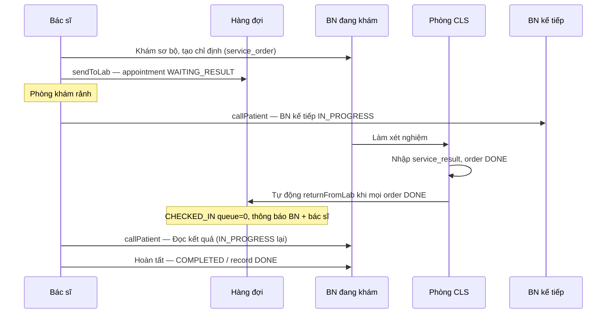
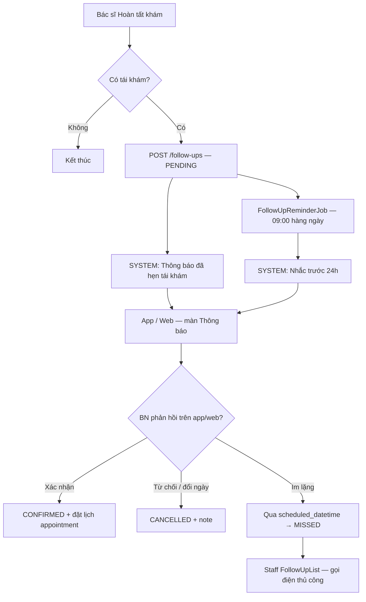

# Phân tích luồng khám bệnh, chỉ định CLS & nhắc tái khám

> **Mục đích:** Chuẩn bị triển khai phần **admin-web** (ConsultationWorkspace + tái khám/thông báo).  
> **Tham chiếu schema:** [`../clinic_system.sql`](../clinic_system.sql) — nhóm 6 (khám & CLS), nhóm 8 (tái khám & thông báo).  
> **Luồng hàng đợi đã có:** [`appointment_flow_scenarios.md`](appointment_flow_scenarios.md) §1 Re-exam.

---

## 1. Đã làm trước đó (admin-web & backend)

### 1.1 Backend (đã triển khai)

| Hạng mục | Trạng thái |
|----------|------------|
| `BookingMode` (DOCTOR / EXPERTISE / SERVICE / DIRECT) | ✅ |
| `AppointmentSlotService` — sinh slot 30 phút | ✅ |
| `AppointmentQueueService` — gọi khám, bỏ qua, trả hàng đợi, **sendToLab**, **returnFromLab** | ✅ |
| Check-in từ `CONFIRMED` (không chỉ `PENDING`) | ✅ |
| `isPriority` — VIP/Cấp cứu (`queueNumber = 0`) | ✅ |
| `isDoctorBusy` — cảnh báo lịch nghỉ bác sĩ | ✅ |
| API `ServiceOrder` — tạo chỉ định gắn `record_id` | ✅ (chưa gắn luồng khám) |
| API `FollowUp` — CRUD + đổi status | ✅ |
| `FollowUpReminderJob` — cron 09:00, nhắc **ngày mai** (D-1) | ✅ (hiện gửi **EMAIL**, cần đổi sang **SYSTEM** cho app/web) |
| `NotificationService` — lưu `notification` + gửi SYSTEM khi queue action | ✅ |
| Patient-web: `/notifications/my` + trang thông báo | ✅ |
| Mobile-app: màn hình thông báo | ⚠️ **mock data**, chưa gọi API |

### 1.2 Admin-web (đã triển khai)

| Hạng mục | Trạng thái |
|----------|------------|
| Hiển thị `bookingMode`, AI badge, nguồn Online/Trực tiếp | ✅ |
| Check-in ưu tiên (`isPriority`) | ✅ |
| Chuyển bác sĩ (`TransferDoctorDialog`) | ✅ |
| **Doctor workflow trên `AppointmentList`** — Gọi khám, Bỏ qua, Chờ kết quả, Hoàn tất | ✅ |
| **Staff workflow** — Return from Lab, Return to Queue | ✅ |
| Cột STT + badge ưu tiên | ✅ |
| Badge trạng thái tiếng Việt | ✅ |
| `ConsultationWorkspace` — Phiếu khám + Kê đơn, header Lưu nháp / Hoàn tất | ⚠️ UI có, **handler chưa wire API** |
| Tạo chỉ định **trong** trang đang khám | ❌ Chưa có |
| Tab xem kết quả CLS trong phiên khám | ❌ Chưa có |
| `FollowUpList` — gọi điện / gửi thông báo | ⚠️ UI có, **chưa gọi API backend** |
| **Bác sĩ tạo tái khám khi hoàn tất khám** | ❌ **Chưa có UI** (xem §5.0) |

### 1.3 Chưa làm (phạm vi hôm nay / tiếp theo)

1. Nút **「Tạo chỉ định」** ngay trong `ConsultationWorkspace`.
2. Đồng bộ trạng thái `appointment` ↔ `medical_record` khi chờ kết quả / đọc kết quả.
3. Máy trạng thái nút thao tác (Khám → Chờ kết quả → Đọc kết quả → Hoàn tất).
4. Xem kết quả xét nghiệm trong phiên khám (tránh trùng nhập liệu với module CLS).
5. Nhắc tái khám qua app / web + phản hồi bệnh nhân.

---

## 2. Mô hình dữ liệu liên quan

```
appointment (status, queue_number)
    └── medical_record (status, diagnosis, treatment, ...)
            ├── service_order (ORDERED → DONE)
            │       └── service_result (result_data, conclusion)  ← 1-1 với order
            ├── prescription
            └── follow_up (scheduled_datetime, status)
                    
patient.account → notification (EMAIL | SYSTEM)
```

**Trạng thái song song cần đồng bộ:**

| appointment.status | medical_record.status | Ý nghĩa |
|--------------------|----------------------|---------|
| `IN_PROGRESS` | `IN_PROGRESS` | Bác sĩ đang khám |
| `WAITING_RESULT` | `WAITING_RESULT` | Đã chỉ định CLS, chờ kết quả; **phòng khám rảnh** |
| `CHECKED_IN` (queue=0) | `IN_PROGRESS` hoặc giữ `WAITING_RESULT` đến khi gọi lại | BN quay lại, ưu tiên đọc kết quả |
| `COMPLETED` | `DONE` | Kết thúc ca khám |

**Gap hiện tại:** `AppointmentQueueService.sendToLab()` chỉ cập nhật `appointment.status = WAITING_RESULT`, **không** cập nhật `medical_record.status`. Cần bổ sung khi implement.

---

## 3. Tình huống: Đang khám → chỉ định xét nghiệm → BN kế tiếp vào khám

### 3.1 Luồng nghiệp vụ thực tế (đã mô tả trong `appointment_flow_scenarios.md`)



**Trả lời câu hỏi:** *Có cho người kế tiếp vào khám không?*  
→ **Có.** Đúng thiết kế backend: `sendToLab` giải phóng phòng, bác sĩ gọi BN tiếp theo (`CHECKED_IN → IN_PROGRESS`). BN cũ ở trạng thái `WAITING_RESULT`, không chiếm slot khám.

### 3.2 Nút thao tác trên `AppointmentList` — máy trạng thái đề xuất

| appointment.status | Vai trò | Nút hiển thị | API / Hành vi |
|--------------------|---------|--------------|---------------|
| `CHECKED_IN` | Bác sĩ | **Gọi khám** | `callPatient` → `IN_PROGRESS` |
| `CHECKED_IN` (queue=0, sau lab) | Bác sĩ | **Đọc kết quả** *(label khác, cùng API)* | `callPatient` → `IN_PROGRESS` |
| `IN_PROGRESS` | Bác sĩ | **Bỏ qua** | `skipPatient` |
| `IN_PROGRESS` | Bác sĩ | **Chờ kết quả** | `sendToLab` → `WAITING_RESULT` |
| `IN_PROGRESS` | Bác sĩ | **Hoàn tất** | `complete` → `COMPLETED` |
| `WAITING_RESULT` | Lễ tân | *(không cần nút)* | Hệ thống **tự** `returnFromLab` khi Lab nhập xong hết KQ |
| `WAITING_RESULT` | Bác sĩ | *(không có nút)* | Chờ auto queue |
| `SKIPPED` | Lễ tân | **Trả về hàng đợi** | `returnToQueue` |

**Nút 「Khám」 ban đầu (`CallPatientButton`) chuyển thành gì?**

1. Sau khi bác sĩ bấm **Chờ kết quả** trên BN A → BN A: `WAITING_RESULT` → **không còn nút Khám** trên dòng A.
2. Bác sĩ chuyển sang gọi BN B → nút **Gọi khám** trên dòng B như bình thường.
3. Khi Lab nhập xong **tất cả** order của BN A → backend **tự động** `returnFromLab`: `CHECKED_IN`, `queueNumber=0`, gửi thông báo SYSTEM cho BN (app/web).
4. Trên dòng A, nút **Đọc kết quả** xuất hiện (cùng API `callPatient`, label khác khi `queueNumber === 0` và có `service_result`).

**Khi đã có kết quả và đang đọc lại (`IN_PROGRESS` lần 2):**

- Giữ **Hoàn tất** (kết thúc ca).
- **Không** hiện lại **Chờ kết quả** nếu không có chỉ định mới (hoặc chỉ hiện khi bác sĩ thêm chỉ định mới trong ConsultationWorkspace).
- Tùy chọn: **Chờ kết quả** nếu bác sĩ chỉ định thêm CLS trong lần đọc kết quả.

### 3.3 Nút trong `ConsultationWorkspace` (đề xuất bổ sung)

| Trạng thái record / appointment | Nút header |
|---------------------------------|------------|
| `IN_PROGRESS`, chưa có order ORDERED | **Tạo chỉ định**, Lưu nháp, Hoàn tất |
| `IN_PROGRESS`, đã có order ORDERED chưa DONE | **Tạo chỉ định** (thêm), **Chuyển chờ kết quả**, Lưu nháp |
| `WAITING_RESULT` | *(readonly)* — banner 「Đang chờ kết quả CLS」; không Hoàn tất |
| `IN_PROGRESS` (đọc kết quả) | Tab **Chỉ định & Kết quả** (read-only), Lưu nháp, **Hoàn tất** |

**Luồng 「Tạo chỉ định」 trong trang khám:**

1. Mở dialog (tái sử dụng `ServiceOrderFormDialog`) — `recordId` và `orderedById` pre-fill từ phiên hiện tại.
2. `POST /service-orders` — tạo một hoặc nhiều order (`status = ORDERED`).
3. In phiếu chỉ định (PDF) — tùy chọn ngay sau tạo.
4. Bác sĩ bấm **Chuyển chờ kết quả** → gọi `sendToLab(appointmentId)` + cập nhật `medical_record.status = WAITING_RESULT`.
5. Navigate về danh sách lịch hoặc auto-load BN kế tiếp.

**Validation trước sendToLab:**

- Phải có ≥ 1 `service_order` với `status = ORDERED` (tránh chuyển trạng thái khi chưa chỉ định gì).
- Không cho `sendToLab` nếu mọi order đã `DONE` (trường hợp đó chờ auto `returnFromLab` + đọc kết quả).

**Quy tắc kê đơn (đã xác nhận):**

- Tab **Kê đơn thuốc** **bị khóa** khi ca khám còn chỉ định CLS chưa có kết quả (`service_order.status = ORDERED`).
- Chỉ mở kê đơn sau khi mọi order liên quan đã `DONE` và bác sĩ đã vào phiên **Đọc kết quả** (`IN_PROGRESS` lần 2) — hoặc ca khám không có chỉ định CLS.
- Backend validate khi tạo `prescription`: reject nếu record còn order `ORDERED`.

---

## 4. Xem kết quả xét nghiệm trong trang khám — có bị trùng không?

### 4.1 Phân vai module

| Module | Vai trò | Ai thao tác |
|--------|---------|-------------|
| **Laboratory / ServiceOrders** | Tạo order (ngoài luồng khám), lấy mẫu, **nhập kết quả** (`service_result`) | KTV / Lab |
| **LabResultDetail** | Xem & in tờ kết quả | Lab, Bác sĩ (tra cứu) |
| **ConsultationWorkspace — tab 「Chỉ định & Kết quả」** | **Chỉ đọc** order + result gắn `record_id` hiện tại | Bác sĩ |

### 4.2 Nguyên tắc tránh trùng

- **Một nguồn sự thật:** `service_result` gắn `order_id` (UNIQUE). Lab nhập **một lần** tại module CLS.
- Trong ConsultationWorkspace: **không** form nhập kết quả — chỉ `GET` orders/results theo `recordId`.
- Link 「Xem chi tiết」→ mở `LabResultDetail` (read-only) hoặc embed cùng component hiển thị.
- Nếu order `ORDERED` / chưa có result: hiển thị badge 「Chờ kết quả」 — bác sĩ biết chưa đọc được.

### 4.3 Khi nào bác sĩ thấy kết quả?

| Thời điểm | Cách xem |
|-----------|----------|
| BN còn `WAITING_RESULT` | Bác sĩ **không** cần xem (đang khám BN khác). Lab làm việc độc lập. |
| Sau `returnFromLab`, trước `callPatient` | Có thể xem sơ trên list (badge 「Đã có KQ」) — tùy chọn. |
| `IN_PROGRESS` lần 2 (đọc kết quả) | Tab **Chỉ định & Kết quả** bắt buộc — bác sĩ đối chiếu khi ghi chẩn đoán / điều trị. |

**Kết luận:** Không trùng nếu ConsultationWorkspace **chỉ đọc** dữ liệu Lab đã nhập; không duplicate form nhập `service_result`.

---

## 5. Nhắc nhở tái khám & thông báo

### 5.0 Hiện tại bác sĩ có chỗ tạo tái khám không?

**Trả lời ngắn: Chưa có UI tạo tái khám trong luồng khám.**

| Lớp | Trạng thái |
|-----|------------|
| **Backend** | `POST /api/v1/follow-ups` — nhận `recordId`, `patientId`, `doctorId`, `scheduledDatetime`, `note` |
| **Admin ConsultationWorkspace** | ❌ Không có form/dialog tái khám khi **Hoàn tất khám** |
| **Admin MedicalRecordDetail** | ❌ API trả `followUps[]` nhưng UI **chưa hiển thị / tạo** |
| **Admin FollowUpList** | Chỉ **xem danh sách** + gọi điện / gửi nhắc (mock) — không tạo mới |
| **followUpApi (FE)** | Chỉ `getAllPaged` + `updateStatus` — **thiếu `create`** |

**Cần bổ sung (đề xuất UI):** Dialog **「Hẹn tái khám」** khi bác sĩ bấm **Hoàn tất khám** (hoặc checkbox 「Có tái khám」→ mở form):

- **Ngày tái khám:** date picker (vd. +7 ngày preset)
- **Giờ gợi ý:** time (optional — có thể chỉ lưu ngày, giờ BN tự chọn khi đặt lịch)
- **Ghi chú:** `note` (vd. 「Tái khám đánh giá đáp ứng điều trị」)
- **Bác sĩ:** pre-fill `doctorId` từ ca hiện tại

→ Gọi `POST /follow-ups`, đồng thời gửi **SYSTEM notification** cho BN: 「Bác sĩ hẹn tái khám ngày …」.

### 5.1 Schema (`follow_up` + `notification`)

```sql
-- follow_up: gắn record_id, patient_id, doctor_id, scheduled_datetime, status
-- status: PENDING | CONFIRMED | COMPLETED | CANCELLED | MISSED

-- notification: account_id, type EMAIL|SYSTEM, content, sent_at
-- SYSTEM = hiển thị trên patient-web + mobile-app (polling API /notifications/my)
```

### 5.2 Luồng đề xuất (ưu tiên app & web bệnh nhân)

**Phạm vi hiện tại:** Gửi thông báo qua **patient-web** và **mobile-app** (type `SYSTEM`). Email/FMC để phase sau.



**Nhắc tự động — đã có sẵn job, cần chỉnh:**

- `FollowUpReminderJob` chạy **09:00 mỗi ngày**, quét follow-up **ngày mai** (≈ **D-1 / 24h**).
- Hiện gửi `NotificationType.EMAIL` + nội dung tiếng Anh → **đổi sang `SYSTEM`**, nội dung tiếng Việt.
- Có thể thêm nhắc ngay khi bác sĩ tạo follow-up (SYSTEM instant).

**Không cần D-3 ở phase này** trừ khi product yêu cầu — D-1 đủ cho 「nhắc trước 24h」.

### 5.3 Kênh thông báo (scope hiện tại)

| Kênh | Trạng thái | Việc cần làm |
|------|------------|--------------|
| **Patient-web** | ✅ `notificationApi.getMyNotifications()` + `NotificationPage` | Nhận SYSTEM từ backend (queue, tái khám, có KQ CLS) |
| **Mobile-app** | ⚠️ UI có, **data mock** | Wire API `/notifications/my` giống patient-web |
| **Admin-web FollowUpList** | ⚠️ Gửi nhắc thủ công mock | Gọi API tạo SYSTEM notification + `updateStatus` |
| **Email** | Job tái khám đang dùng EMAIL | Tắt/chuyển sang SYSTEM; email optional phase 2 |
| **FCM push** | Chưa có | Phase 2 — hiện dùng in-app list + badge |

### 5.4 Phản hồi bệnh nhân (app / web)

Endpoint đề xuất:

- `POST /follow-ups/{id}/confirm` — BN xác nhận → `CONFIRMED` → redirect flow **đặt lịch** (chọn slot).
- `POST /follow-ups/{id}/decline` — BN hủy / xin đổi → `CANCELLED` + lý do.

Staff admin (fallback):

- **Gọi điện** — log `note`, `updateStatus`.
- **Gửi nhắc thủ công** — `NotificationService.createAndSendNotification(..., SYSTEM)`.

### 5.5 Tái khám: `follow_up` vs tạo luôn `appointment`? (phân tích)

| Phương án | Ưu | Nhược |
|-----------|-----|-------|
| **A. Chỉ `follow_up`** | Bác sĩ nhanh (chọn 「7 ngày sau」+ ghi chú); không block slot; BN tự đặt lịch qua app | Có thể BN quên đặt; lễ tân phải theo dõi PENDING/MISSED |
| **B. Bắt buộc tạo `appointment` ngay** | Có slot cố định, check-in/queue rõ | Bác sĩ khó biết slot trống xa; dễ conflict lịch nghỉ; form nặng |
| **C. Hybrid (khuyến nghị)** | Cân bằng thực tế phòng khám | Implement 2 bước |

**Khuyến nghị — mô hình Hybrid (C):**

1. **Khi hoàn tất khám:** Bác sĩ tạo **`follow_up`** (ngày + ghi chú; giờ optional). Gửi SYSTEM ngay.
2. **BN xác nhận trên app/web:** Chuyển `CONFIRMED` → mở màn **đặt lịch** (chọn bác sĩ/slot) → tạo `appointment` mới (`bookingMode=DOCTOR`, link `note` tái khám).
3. **Tùy chọn nâng cao:** Checkbox 「Đặt lịch luôn」 trong dialog — nếu bác sĩ chọn slot cụ thể ngay thì tạo cả `follow_up` + `appointment` trong một transaction.

→ **Không bắt buộc** appointment ngay lúc khám xong; **có đường** tạo appointment khi BN phản hồi hoặc bác sĩ chủ động chọn slot.

**Đã chốt:** Product chọn **Hybrid (C)**.

### 5.5.1 Phân tích bảng `follow_up` vs Hybrid (C)

Schema hiện tại (`clinic_system.sql` §20):

```sql
CREATE TABLE follow_up (
    follow_up_id INT AUTO_INCREMENT PRIMARY KEY,
    record_id INT NOT NULL,           -- ca khám gốc
    patient_id INT NOT NULL,
    doctor_id INT NOT NULL,
    scheduled_datetime DATETIME NOT NULL,
    note VARCHAR(255),
    status ENUM('PENDING','CONFIRMED','COMPLETED','CANCELLED','MISSED') DEFAULT 'PENDING',
    created_at DATETIME DEFAULT CURRENT_TIMESTAMP,
    ...
);
```

#### Khớp với Hybrid (C) — phần đã đủ

| Trường | Vai trò trong Hybrid | Đánh giá |
|--------|---------------------|----------|
| `record_id` | Gắn tái khám với **ca khám vừa xong** (tra cứu lịch sử, in phiếu) | ✅ Đúng |
| `patient_id` | Lọc danh sách nhắc theo BN (`FollowUpList`, job D-1) | ✅ Hợp lý *(denormalize)* |
| `doctor_id` | Bác sĩ hẹn tái khám (pre-fill khi BN đặt lịch `DOCTOR`) | ✅ Đúng |
| `scheduled_datetime` | Ngày/giờ **dự kiến** tái khám + trigger nhắc D-1 | ✅ Cốt lõi |
| `note` | Ghi chú bác sĩ (vd. 「Tái khám 7 ngày, theo dõi HbA1c」) | ✅ Đúng |
| `status` | Máy trạng thái luồng (xem bảng dưới) | ✅ Khớp ý tưởng |
| `created_at` | Audit | ✅ |

#### Máy trạng thái `status` (map Hybrid C)

| Status | Ý nghĩa đề xuất | Khi nào |
|--------|-----------------|---------|
| `PENDING` | Bác sĩ đã hẹn, chờ BN phản hồi / đặt lịch | Sau `POST /follow-ups` |
| `CONFIRMED` | BN xác nhận sẽ tái khám (app/web) | Sau `confirm` |
| `COMPLETED` | BN **đã đến khám** tái khám (ca thực tế xong) | Khi `appointment` liên kết → `COMPLETED` |
| `CANCELLED` | BN hủy / đổi ý | Sau `decline` hoặc staff hủy |
| `MISSED` | Qua `scheduled_datetime` mà chưa có ca | Job tự động hoặc staff đánh dấu |

→ Enum **5 giá trị hiện tại đủ dùng** cho Hybrid; không cần thêm status mới nếu có `appointment_id` (xem dưới).

#### Thiếu — nên bổ sung cho Hybrid (C)

| Trường đề xuất | Kiểu | Lý do |
|----------------|------|-------|
| **`appointment_id`** | `INT NULL`, FK → `appointment` | **Quan trọng nhất.** Bước 2/3 Hybrid: khi BN đặt lịch (hoặc bác sĩ 「Đặt lịch luôn」) → gắn lịch thật. Không có FK thì không truy vết được follow-up ↔ appointment, khó auto `COMPLETED`. |
| `confirmed_at` | `DATETIME NULL` | Thời điểm BN bấm xác nhận trên app/web. |
| `reminder_sent_at` | `DATETIME NULL` | Tránh job D-1 gửi trùng; audit đã nhắc chưa. |
| `cancel_reason` | `VARCHAR(255) NULL` | BN/staff hủy — tách khỏi `note` bác sĩ. |
| `updated_at` | `DATETIME ON UPDATE` | Chuẩn audit (bảng hiện chỉ có `created_at`). |

**Tùy chọn phase 2 (chưa bắt buộc):**

| Trường | Lý do |
|--------|-------|
| `created_by` ENUM('DOCTOR','STAFF') | Ai tạo lịch tái khám |
| `created_by_staff_id` INT NULL | Nếu lễ tân tạo thay bác sĩ |

#### Dư / trùng — có nên giữ?

| Trường | Phân tích |
|--------|-----------|
| `patient_id` | **Trùng** với `medical_record.patient_id` — nhưng **nên giữ**: query `FollowUpList`, job nhắc, index theo BN không cần JOIN record. Denormalize có chủ đích. |
| `doctor_id` | Có thể lấy từ `medical_record.main_doctor_id` — **nên giữ**: tái khám có thể vẫn cùng bác sĩ dù record đổi `updated_by_doctor_id`; pre-fill rõ ràng khi BN đặt lịch. |

→ **Không có cột thừa gây hại**; chỉ thiếu liên kết sang `appointment`.

#### Hạn chế thiết kế hiện tại

1. **`scheduled_datetime NOT NULL`** — Hybrid nói 「giờ optional」: hiện bắt buộc cả giờ. Workaround MVP: UI default `09:00` nếu bác sĩ chỉ chọn ngày. Hoặc migration tách `scheduled_date DATE` + `scheduled_time TIME NULL` (phase 2).
2. **`note VARCHAR(255)`** — `FollowUpList` append log gọi điện (`note | Log: ...`) dễ **tràn 255 ký tự**. Nên đổi `TEXT` hoặc tách bảng `follow_up_log`.
3. **Không FK `appointment_id`** — bước 「BN đặt lịch → tạo appointment」không có chỗ gắn; phải tìm ngược bằng `patient_id + doctor_id + date` (mơ hồ, dễ sai).
4. **`notification` không link `follow_up_id`** — bảng `notification` chỉ có `account_id` + `content`; không biết thông báo thuộc follow-up nào (chấp nhận được MVP, optional thêm `reference_type` / `reference_id` sau).

#### DDL migration đề xuất (tối thiểu cho Hybrid C)

```sql
ALTER TABLE follow_up
    ADD COLUMN appointment_id INT NULL AFTER doctor_id,
    ADD COLUMN confirmed_at DATETIME NULL AFTER status,
    ADD COLUMN reminder_sent_at DATETIME NULL AFTER confirmed_at,
    ADD COLUMN cancel_reason VARCHAR(255) NULL AFTER note,
    ADD COLUMN updated_at DATETIME DEFAULT CURRENT_TIMESTAMP ON UPDATE CURRENT_TIMESTAMP,
    ADD CONSTRAINT fk_followup_appointment
        FOREIGN KEY (appointment_id) REFERENCES appointment(appointment_id);

CREATE INDEX idx_followup_appointment ON follow_up(appointment_id);
CREATE INDEX idx_followup_status_datetime ON follow_up(status, scheduled_datetime);
```

**Luồng sau migration:**

1. Bác sĩ tạo → `PENDING`, `appointment_id = NULL`.
2. BN confirm + đặt lịch → `CONFIRMED`, `appointment_id = {id mới}`, `confirmed_at = NOW()`.
3. 「Đặt lịch luôn」→ tạo `appointment` + `follow_up` cùng lúc, set `appointment_id` ngay, `status = CONFIRMED`.
4. Ca khám tái khám `COMPLETED` → cập nhật follow-up → `COMPLETED`.
5. Job D-1 → set `reminder_sent_at` sau khi gửi SYSTEM.

#### Kết luận schema

| | |
|--|--|
| **Giống ý Hybrid (C)?** | **~80%** — đủ cho bước 1 (hẹn + nhắc + status). |
| **Thiếu quan trọng** | `appointment_id` (+ nên có `confirmed_at`, `reminder_sent_at`). |
| **Dư** | Không — `patient_id` / `doctor_id` denormalize hợp lý. |
| **Nên sửa nhẹ** | `note` → `TEXT`; cân nhắc `scheduled_time` optional. |

---

### 5.6 Gap code hiện tại

- `FollowUpList.tsx`: `handleSendNotification` / `handleLogCall` — **mock local**, chưa API.
- `followUpApi.ts`: thiếu `create`.
- `FollowUpReminderJob`: EMAIL → cần **SYSTEM** + tiếng Việt.
- `ConsultationWorkspace`: thiếu dialog tái khám khi hoàn tất.
- `ServiceResultService.submitResult`: đã notify bác sĩ SYSTEM; **chưa** auto `returnFromLab` (§3).

---

## 6. Checklist triển khai (thứ tự đề xuất)

### Phase A — ConsultationWorkspace (ưu tiên hôm nay)

- [ ] Tab **Chỉ định & Kết quả** — list orders theo `recordId`, read-only results.
- [ ] Nút **Tạo chỉ định** — dialog + `laboratoryApi.createServiceOrder`.
- [ ] Nút **Chuyển chờ kết quả** — `appointmentApi.sendToLab` + sync `medical_record.status`.
- [ ] Wire **Lưu nháp** / **Hoàn tất** — `medicalApi` + `appointmentApi.complete`.
- [ ] Backend: `ServiceResultService` — khi **mọi** order của record DONE → auto `returnFromLab` + notify BN (SYSTEM).
- [ ] Backend: `sendToLab` / `callPatient` / auto return sync `medical_record.status`.
- [ ] Khóa tab **Kê đơn** nếu còn order `ORDERED`; validate backend khi tạo prescription.
- [ ] `AppointmentTable`: label **Đọc kết quả** khi `queueNumber === 0` && có result DONE.
- [ ] Validation: không `sendToLab` nếu chưa có order ORDERED.
- [ ] Gỡ nút **Đã có kết quả** khỏi `AppointmentTable` (lễ tân không cần bấm).

### Phase B — Tái khám & thông báo (app + web)

- [ ] **Migration `follow_up`:** `appointment_id`, `confirmed_at`, `reminder_sent_at`, `cancel_reason`, `updated_at` (§5.5.1).
- [ ] Entity + DTO + mapper cập nhật theo migration.
- [ ] Dialog **Hẹn tái khám** trong ConsultationWorkspace (ngày, ghi chú, preset +7 ngày).
- [ ] `followUpApi.create` + gửi SYSTEM ngay khi tạo.
- [ ] Sửa `FollowUpReminderJob`: **SYSTEM** + tiếng Việt (nhắc D-1 lúc 09:00).
- [ ] Fix `FollowUpList` — API thật khi gọi điện / gửi nhắc.
- [ ] Patient-web: nút xác nhận tái khám trên notification (→ confirm + đặt lịch).
- [ ] Mobile-app: wire `/notifications/my` (bỏ mock).

### Phase C — Tinh chỉnh

- [ ] Hybrid 「Đặt lịch luôn」— tạo `follow_up` + `appointment` một lần (tùy chọn).
- [ ] Auto MISSED job sau `scheduled_datetime`.
- [ ] Email / FCM push (phase 2).
- [ ] Báo cáo MISSED follow-up trên dashboard.

---

## 7. Quyết định đã xác nhận & còn mở

| # | Chủ đề | Quyết định |
|---|--------|------------|
| 1 | Lab xong → đưa BN về hàng đợi | ✅ **Tự động** `returnFromLab` khi mọi order DONE (không cần lễ tân bấm) |
| 2 | Kê đơn khi chờ CLS | ✅ **Bắt buộc đọc KQ** rồi mới kê (khóa tab + validate backend) |
| 3 | Kênh nhắc tái khám | ✅ **SYSTEM** trên **patient-web + mobile-app**; job **D-1 (~24h)** lúc 09:00 |
| 4 | Tái khám vs appointment | ✅ **Hybrid (C)** — cần migration thêm `appointment_id` (§5.5.1) |

---

## 8. Liên kết code hiện có

| Thành phần | Đường dẫn |
|------------|-----------|
| Consultation UI | `clinic-frontend/admin-web/src/features/medical/pages/ConsultationWorkspace.tsx` |
| Appointment actions | `.../appointments/components/AppointmentTable.tsx` |
| Queue API FE | `.../appointments/api/appointmentApi.ts` |
| Queue service BE | `.../AppointmentQueueService.java` |
| Service order | `.../ServiceOrderService.java`, `ServiceOrderFormDialog.tsx` |
| Follow-up job | `FollowUpReminderJob.java` |
| Follow-up create API | `FollowUpController.java`, `FollowUpRequest.java` |
| Notification | `NotificationService.java` |

---

*Tài liệu tạo: 2026-06-24 — phục vụ sprint admin-web: luồng khám + CLS + tái khám.*
